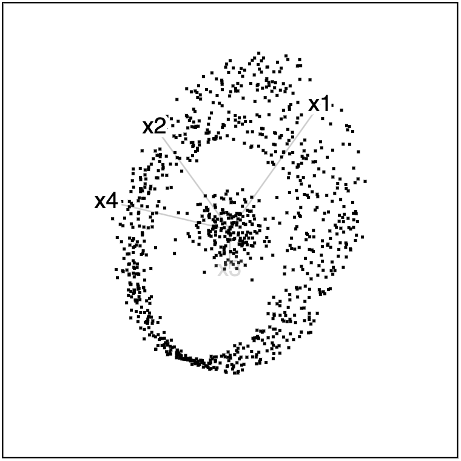
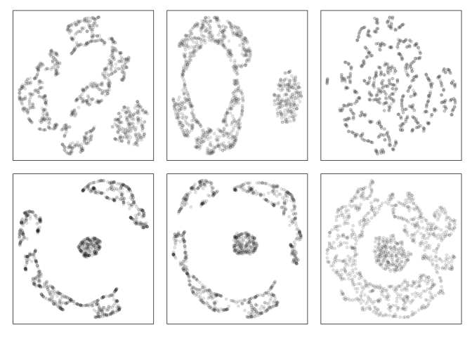

<!-- README.md is generated from README.Rmd. Please edit that file -->

# cardinalR 

[](https://CRAN.R-project.org/package=cardinalR)
[](https://cran.r-project.org/package=cardinalR)

The `cardinalR` package provides acollection of functions to generate a
large variety of structures in high dimensions.

## Installation

You can install the released version of `cardinalR` from
[CRAN](https://CRAN.R-project.org) with:

``` r
install.packages("cardinalR") 
```

The development version from [GitHub](https://github.com/) with:

``` r
# install.packages("pak")
pak::pak("JayaniLakshika/cardinalR")
```

## Example

``` r
library(cardinalR)
```

``` r
head(mobiusgau, 5)
#> # A tibble: 5 × 4
#>        x1       x2       x3      x4
#>     <dbl>    <dbl>    <dbl>   <dbl>
#> 1  0.517  -0.579   -0.00951 -0.0401
#> 2  0.0142 -0.00841  0.0147   0.0579
#> 3 -0.402   0.506   -0.196   -0.0325
#> 4 -0.218  -0.684    0.0347   0.0497
#> 5  0.225   0.699    0.00575  0.0251
```

<table style="width:100%">

<tr>

<td align="center">


</td>

<td align="center">


</td>

<td align="center">


</td>

</tr>

</table>

You can find the high-dimensional view in
[here](https://youtu.be/731aZxDifCs).

tSNE (t-distributed Stochastic Neighbor Embedding) and UMAP (Uniform
Manifold Approximation and Projection) representations of
`mobius_clust_data` are shown below.



## About the name

**C**ollection of v**ar**ious high-**d**imens**i**o**nal** data
structures in **R**

## Copyright

This package is licensed under the [MIT
license](https://github.com/JayaniLakshika/cardinalR/tree/main?tab=MIT-2-ov-file).
